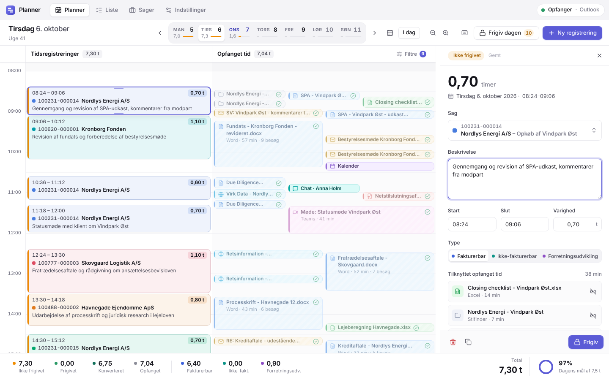
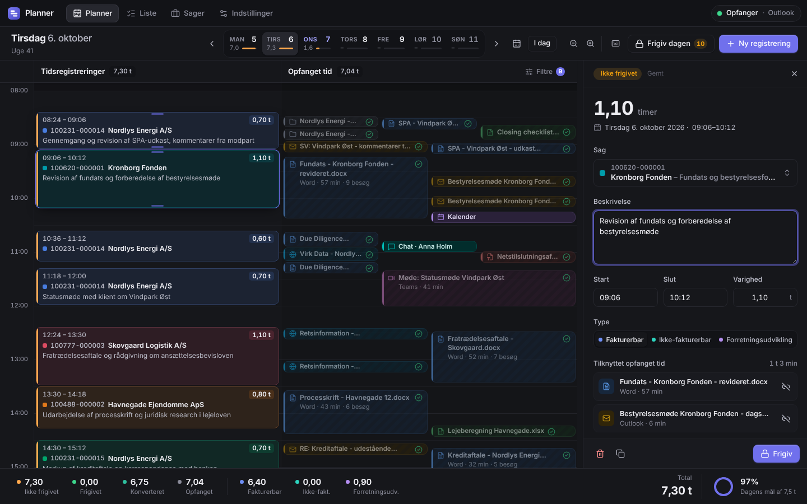
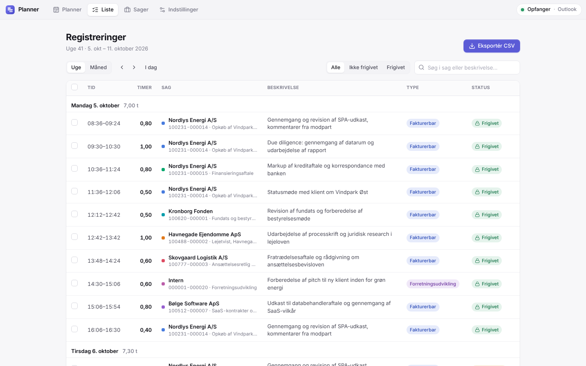

# Planner – interaktiv tidsregistrering til Windows

Planner holder automatisk øje med, hvilke programmer, dokumenter, e-mails og browserfaner du arbejder i, og viser det som **Opfanget tid** ved siden af dine **Tidsregistreringer** – inspireret af _Planner_-visningen i Intapp Time. Træk den opfangede tid over i tidslinjen, vælg sag, og frigiv. Alle data bliver på din egen computer.



## Funktioner

- **Automatisk opfangning** af aktivt program og vinduestitel (Word-dokumenter, Outlook-mails, Teams-møder, browserfaner, PDF'er …) via Windows' egne API'er. Inaktivitet, skærmlås og dvale registreres, så pauser ikke tæller med.
- **Planner-visning** med to synkroniserede tidslinjer: tidsregistreringer og opfanget tid. Besøg i samme dokument samles i én blok, og overlappende arbejde lægges side om side.
- **Træk og slip**: Træk en opfanget blok over i registreringerne, eller klik og træk i tidslinjen for at oprette en registrering. Registreringer kan flyttes og trækkes længere eller kortere. Alt afrundes til din tidsenhed (standard 6 min = 0,1 t).
- **Intelligente sagsforslag** ud fra dokumentnavne, e-mailemner, sagsnumre og nøgleord.
- **Editor-panel** med autosave, sagsvælger med søgning, beskrivelse, tider, type (fakturerbar / ikke-fakturerbar / forretningsudvikling) og tilknyttet opfanget tid.
- **Frigivelse og låsning** af registreringer. Frigivelse kræver en sag. **Fortryd** (Ctrl+Z) virker på oprettelse, sletning, flytning, ændring af tider og dato, frigivelse og genåbning.
- **Ugeoversigt og mål**: timer pr. dag i værktøjslinjen samt dagens fremdrift mod dit mål. Nederst vises nøgletal som i Intapp: ikke frigivet, frigivet, konverteret, opfanget, fakturerbar og så videre.
- **Liste** pr. uge eller måned med filtre, massefrigivelse og **CSV-eksport** til Excel eller jeres tidssystem.
- **Sager**: opret, rediger og arkivér sager, eller **importér fra CSV eller direkte fra Excel** (kopiér og indsæt) med automatisk kolonnegenkendelse.
- **Privatliv**: pause i 15 min eller 1 time, ekskluderede programmer, sletning af opfanget tid og automatisk oprydning efter et antal dage.
- **Dansk og engelsk**, lyst og mørkt tema, tastaturgenveje (`?` viser dem), systembakke og start med Windows.
- **Sikre automatiske opdateringer**, der er krypteret og digitalt signeret (se nedenfor).

| Mørkt tema | Liste og eksport |
| --- | --- |
|  |  |

## Installation

1. Hent `Planner-Setup-x.y.z.exe` under [Releases](../../releases). Under hver kørsel af [Actions](../../actions) ligger der også en build som artefakt.
2. Kør installationen. Den installerer kun for den aktuelle bruger, så der kræves ikke administratorrettigheder.
   Installationen er ikke kodesigneret med et Windows-certifikat, så Windows SmartScreen kan vise _"Windows beskyttede din pc"_ første gang. Vælg **Flere oplysninger → Kør alligevel**. Herefter opdaterer appen sig selv.
3. Planner starter i systembakken og begynder at opfange med det samme.

## Privatliv og datasikkerhed

**Alle data gemmes udelukkende lokalt på brugerens PC** og sendes aldrig til skyen, til GitHub eller andre steder.

| Hvad | Hvor |
| --- | --- |
| Registreringer, sager, indstillinger | `%LOCALAPPDATA%\Planner\data\*.json` |
| Opfanget tid (én fil pr. dag) | `%LOCALAPPDATA%\Planner\data\activity\` |
| Daglige sikkerhedskopier (14 dage) | `%LOCALAPPDATA%\Planner\data\backups\` |

- Dataene ligger i `%LOCALAPPDATA%`, som ikke følger med roaming-profiler. De bliver altså på maskinen.
- Der opfanges kun **programnavn, vinduestitel og tidspunkter**. Der opfanges aldrig dokumentindhold, tastetryk eller skærmbilleder.
- **Ingen telemetri, ingen crash-rapporter og ingen analyse.** Skrifttyper og alle andre ressourcer ligger i appen.
- **Brugerfladen er spærret for netværk.** Alle forespørgsler, der ikke er lokale, afvises (Content-Security-Policy og en netværksspærre i Electron), og alle tilladelser (kamera, mikrofon, placering …) nægtes. Den automatiske test i CI kontrollerer det ved hver build.
- **Den eneste netværksforbindelse er opdateringstjekket.** Det henter en offentlig, signeret fil over HTTPS og sender ingen brugerdata (ingen cookies og ingen identifikation ud over versionsnummeret).
- Opfanget tid slettes automatisk efter 90 dage (kan ændres). Registreringer slettes aldrig automatisk.

## Sikre automatiske opdateringer

Nye versioner hentes og installeres automatisk i baggrunden. Brugeren skal aldrig selv downloade appen igen. Et diskret **"Opdatering klar"** i titellinjen lader brugeren genstarte med det samme. Ellers installeres opdateringen, når Planner lukkes.

Sådan sikres det, at **kun du** kan udgive opdateringer:

1. **Krypteret transport**: Alt hentes over HTTPS. Forespørgsler og omdirigeringer uden HTTPS afvises.
2. **Digital signatur (Ed25519)**: Opdateringsmanifestet (`update.json`) skal være signeret med din private nøgle. Den tilhørende offentlige nøgle er bygget ind i appen (`src/main/update/trustedKeys.ts`). En opdatering med forkert eller manglende signatur afvises, også selv om nogen skulle få adgang til download-serveren eller GitHub-udgivelsen.
3. **Integritet (SHA-512)**: Installationsfilens størrelse og SHA-512-kontrolsum står i det signerede manifest. Filen kontrolleres efter download og igen lige før installation.
4. **Ingen nedgradering**: Kun versioner, der er nyere end den installerede, accepteres. Manifestet er også bundet til app-id, platform og kanal.
5. **Fail closed**: Uden en betroet nøgle i appen er opdateringer slået fra, og der installeres intet.

### Engangsopsætning (på din egen PC)

Du skal kun gøre dette én gang. Den private nøgle laves og bliver på din egen PC. Den må aldrig ligge på GitHub.

**1. Lav nøglen**

1. Installér Node.js (versionen mærket _LTS_) fra [nodejs.org](https://nodejs.org). Vælg standardindstillingerne.
2. Åbn repositoryet på GitHub. Klik på den grønne knap **Code → Download ZIP**.
3. Højreklik på ZIP-filen, og vælg **Udpak alle**.
4. Åbn den udpakkede mappe (den, der indeholder mappen `scripts`). Klik i adresselinjen øverst i Stifinder, skriv `cmd`, og tryk Enter. Der åbnes et sort vindue i mappen.
5. Skriv denne kommando, og tryk Enter:

   ```
   node scripts/update-keygen.mjs
   ```

   Der skal ikke installeres andet først.
6. Kommandoen gemmer den private nøgle i `C:\Users\<dit navn>\.planner-signing\planner-update-signing-key.pem` og viser en linje, der begynder med `{ id: '`. Den linje er den offentlige nøgle. Den er ikke hemmelig.

**2. Læg den offentlige nøgle på GitHub**

1. Åbn `src/main/update/trustedKeys.ts` på GitHub, og klik på blyanten (**Edit this file**).
2. Indsæt hele linjen fra kommandoen mellem `// <trusted-keys>` og `// </trusted-keys>`.
3. Klik **Commit changes**.

Du kan også bare sende linjen til Claude og bede om at få den lagt ind.

**3. Lav et beskyttet miljø til nøglen**

1. På GitHub: **Settings → Environments → New environment**. Kald det `release`.
2. Sæt hak i **Required reviewers**, og tilføj dig selv. Så kan intet signeres uden din godkendelse.
3. Under **Deployment branches and tags**: vælg _Selected branches and tags_ → **Add deployment branch or tag rule** → vælg _Tag_ → skriv `v*.*.*`.
4. Klik **Add environment secret**. Navn: `PLANNER_UPDATE_SIGNING_KEY`. Værdi: hele indholdet af `.pem`-filen. Åbn den i Notesblok (kommandoen viser den præcise sti), tryk Ctrl+A og Ctrl+C, og indsæt i feltet.
5. Gem en kopi af `.pem`-filen et sikkert sted, for eksempel i en password manager. Mister du den, kan de installerede kopier ikke længere opdateres automatisk.

Du kan slette den udpakkede mappe og ZIP-filen bagefter. Den private nøgle ligger ikke i dem.

**4. Installér den første signerede version manuelt**

Versioner, der er bygget før nøglen kom ind i `trustedKeys.ts`, kan ikke opdatere sig selv. Udgiv derfor en version som beskrevet nedenfor, og installér den én gang på hver PC med installationsfilen fra GitHub Releases. Derefter kommer opdateringer automatisk.

_For udviklere:_ Du kan også signere lokalt: byg installationen, kør `npm run update:sign -- --installer <fil.exe> --base-url <https://…> --key <nøgle.pem>`, og upload `update.json` selv.

### Udgiv en ny version

Alt foregår i browseren:

1. Gå til repositoryet på GitHub → **Releases → Draft a new release**.
2. Klik **Choose a tag**, skriv et nyt versionsnummer, for eksempel `v1.1.0`, og vælg **Create new tag**. Nummeret skal have formen `v` + tre tal og være højere end den sidste version. Lad _Target_ stå på `Main`.
3. Skriv eventuelt en titel og en beskrivelse (eller klik **Generate release notes**). Lad _Set as the latest release_ være slået til, og sæt ikke hak i _pre-release_.
4. Klik **Publish release**.
5. Gå til **Actions**. Når workflowet **Release** venter på dig (efter ca. 15-30 minutter), klik **Review deployments**, sæt hak ved `release`, og klik **Approve and deploy**.

Indtil kørslen er godkendt og færdig, kan Planner melde, at opdateringstjekket fejlede. Det er forventet og retter sig selv ved næste tjek.

Installationsfilen og `update.json` bliver derefter lagt på udgivelsen. Versionsnummeret kommer fra tagget, så `package.json` skal ikke ændres.

Workflowet **Release** kører i tre trin:

1. **Kontrol**: Tagget skal have formen `v1.2.3`, og appen skal have en betroet nøgle.
2. **Byg**: Installationen bygges og testes på Windows præcis som i CI, inklusive røgtesten, med versionen fra tagget. Jobbet har ikke adgang til nøglen.
3. **Signér og udgiv**: Når du har godkendt kørslen under _Actions_, signeres manifestet, og filerne lægges på GitHub-udgivelsen. Nøglen bruges kun i dette job. Det installerer ingen npm-pakker, og ud over GitHubs egne standardhandlinger kører det kun projektets eget signeringsscript, så en kompromitteret npm-pakke ikke kan få fat i nøglen.

Fejler et trin, kan du åbne kørslen under _Actions_ og klikke **Re-run failed jobs**. Udviklere kan i stedet pushe et tag (`git tag v1.1.0 && git push origin v1.1.0`); så opretter workflowet selv udgivelsen.

Installerede kopier finder opdateringen inden for få timer. Brugeren kan også vælge _Søg efter opdateringer_ under Indstillinger.

**Nøglerotation:** Tilføj den nye nøgle i `trustedKeys.ts`, udgiv én version signeret med den gamle nøgle, og fjern derefter den gamle. Mister du den private nøgle, skal brugerne installere en ny version manuelt én gang.

**Valgfrit:** Med et Authenticode-kodesigneringscertifikat forsvinder SmartScreen-advarslen ved første installation. Opdateringssikkerheden afhænger ikke af det.

## Brug

| Handling | Sådan |
| --- | --- |
| Opret registrering fra opfanget tid | Træk blokken over i _Tidsregistreringer_, dobbeltklik på den, eller vælg flere (Ctrl+klik) og tryk Enter |
| Opret registrering manuelt | Klik og træk i tidslinjen, dobbeltklik, eller tryk **N** |
| Flyt eller ændr længde | Træk i registreringen eller i dens øverste/nederste kant |
| Frigiv | **Ctrl+Enter**, knappen _Frigiv_ eller _Frigiv dagen_ |
| Slet / fortryd | **Delete** / **Ctrl+Z** |
| Skift dag | **←** / **→**, **T** for i dag |
| Zoom i tidslinjen | **+** / **−** |
| Alle genveje | **?** |

Højreklik på blokke og registreringer giver flere muligheder, for eksempel _Ekskludér program fra opfangning_ og _Slet fra opfanget tid_.

## Udvikling

Kræver Node.js 22.

```bash
npm install
npm run dev          # desktop-app med hot reload (Electron)
npm run dev:web      # brugerfladen i browseren med simuleret aktivitet
npm test             # unit-tests (Vitest)
npm run test:e2e     # end-to-end-tests (Playwright)
npm run typecheck
npm run package:win  # Windows-installation i release/
```

Desktop-appen kan køres med simuleret aktivitet og demodata på alle styresystemer: `PLANNER_DEMO=1 npm run dev`.

### Arkitektur

```
src/
  core/        Platformsuafhængig kerne: datamodel, sporingsmotor, titel-parser,
               sammenlægning, layout, CSV, sagsforslag, i18n og PlannerService (backend)
  main/        Electron-hovedproces: Win32-sporing (koffi FFI + PowerShell-reserve),
               fillagring, IPC, systembakke, netværksspærre og sikker updater
  preload/     Minimal, typet bro (window.planner) til den sandboxede brugerflade
  renderer/    React-brugerflade: planner, liste, sager, indstillinger
tests/         Unit-tests og Playwright-tests
scripts/       Ikoner, nøglegenerering og signering af opdateringer
```

- **Én kontrakt**: `PlannerApi` (`src/core/api.ts`) er hele grænsefladen mellem brugerflade og backend. Desktop-appen eksponerer `PlannerService` over IPC, og browser-builden kører præcis samme service med localStorage. En ny funktion kræver en metode i `PlannerApi` og en implementering i `PlannerService`.
- **Udskiftelige kilder**: Sporing sker via `WindowProvider` (`src/core/tracking/types.ts`). Nye kilder, for eksempel en browserudvidelse med URL'er eller Outlook-kalender, kan tilføjes uden at ændre resten.
- **Lagring** sker via `KeyValueStorage`. JSON-filer i dag (atomiske skrivninger og daglige backups), og SQLite eller synkronisering kan tilføjes som en ny implementering.
- **Nye programmer** genkendes ved at tilføje dem til `APP_CATALOG` (`src/core/activity/apps.ts`).
- **Tekster** ligger i `src/core/i18n/da.ts` og `en.ts` (typecheckede nøgler).

### Kvalitetssikring

- **Unit-tests** af parser, sammenlægning, layout, sporingsmotor (idle, midnat, pause), lagring, backend, CSV, sagsforslag, opdateringssikkerhed (manipulerede manifester, forkerte nøgler, ændrede filer, nedgradering) og Win32-FFI-bindingerne (mod et mock-bibliotek med samme signaturer).
- **End-to-end-tests** af træk og slip, oprettelse, flytning, frigivelse, fortryd, filtre, sprog og tema, sager, import, eksport og opdaterings-UI.
- **CI på Windows** pakker installationen og kører en røgtest af den færdige `Planner.exe`. Røgtesten kontrollerer ægte Win32-sporing, lagring, IPC, brugerflade og at brugerfladen ikke kan nå internettet.
